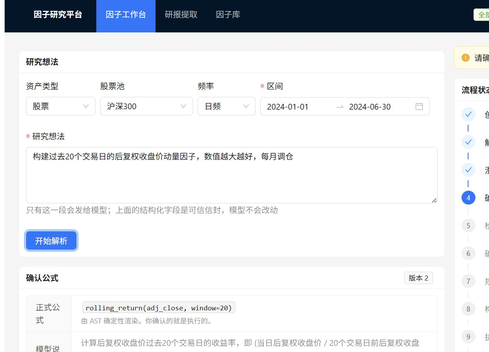
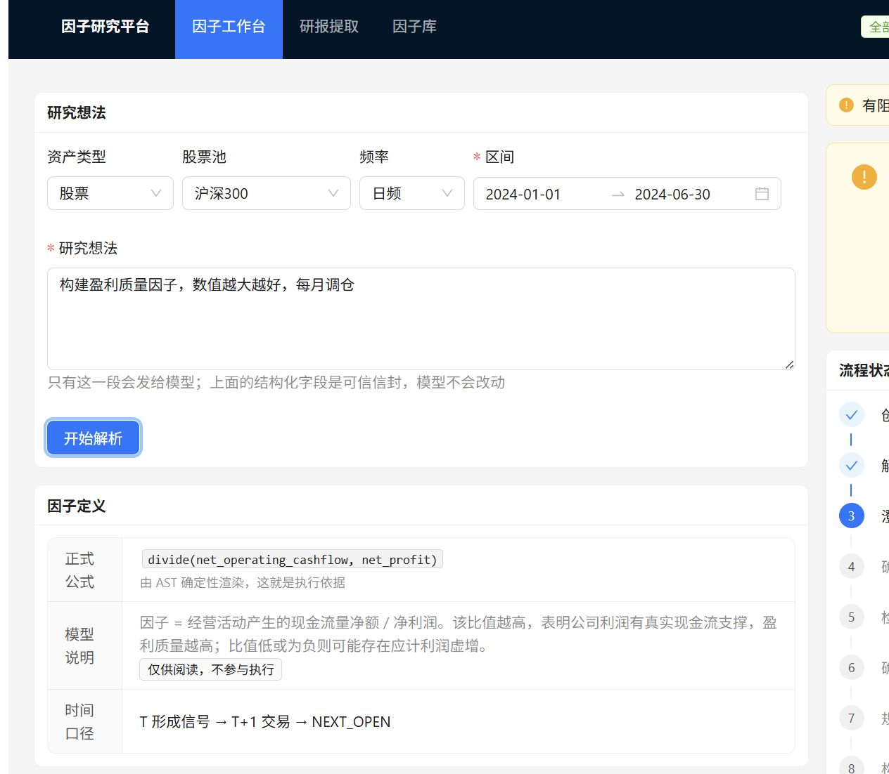
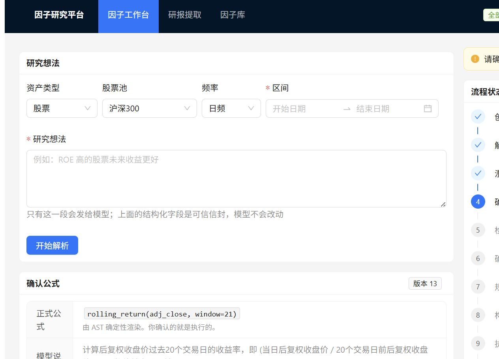
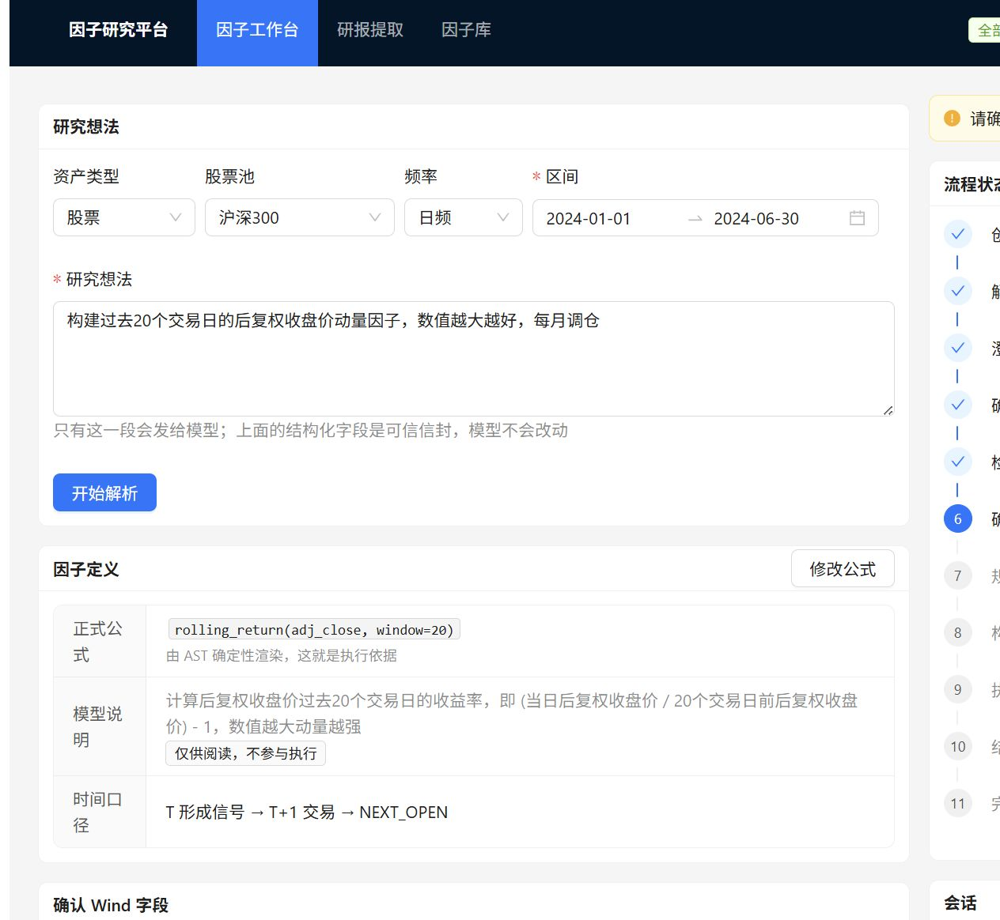
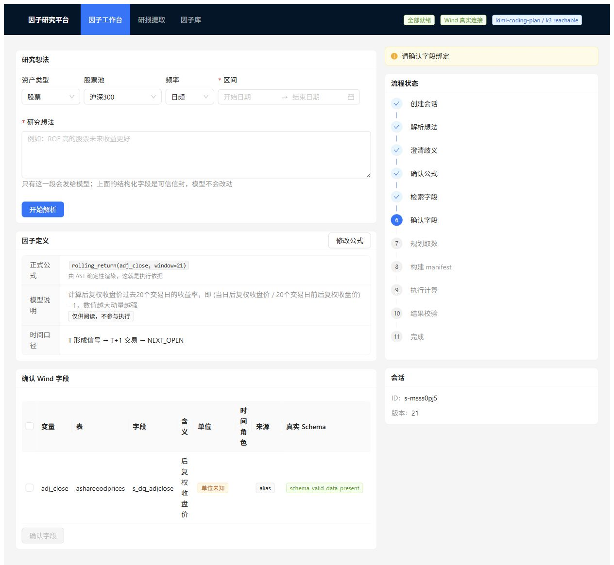
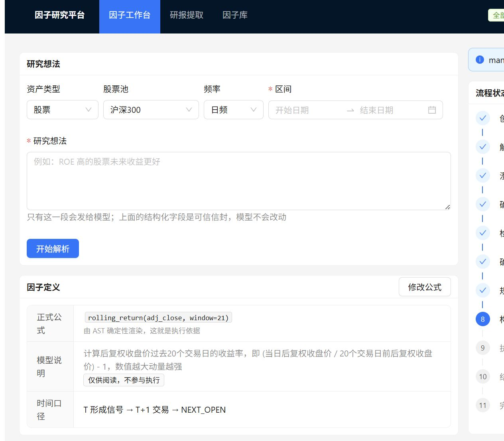
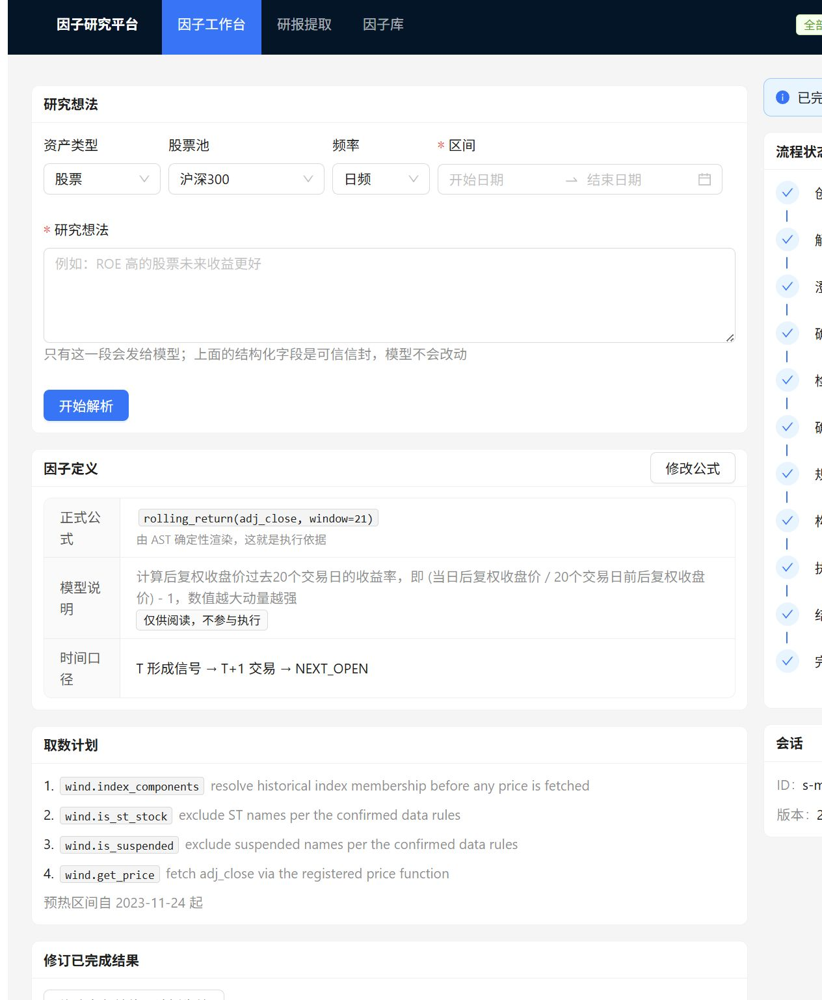

# 真实浏览器五场景

环境：真实 React 页面 + FastAPI + Kimi Coding Plan/k3 + 真实 Wind + signed manifest + 隔离 Worker。浏览器使用实际页面交互，不以直接 API 请求代替。

顶部健康状态实测显示：

- `全部就绪`
- `Wind 真实连接`
- `kimi-coding-plan / k3 reachable`

## 1. 明确因子

输入过去 20 日收益率因子，真实 k3 生成 FactorSpec，页面展示由 AST 确定性渲染的公式并进入字段、计划和执行链路。

## 2. 阻塞性歧义

输入“盈利质量高的股票未来收益更高”，页面没有武断选择 ROE，而是展示 ROE_TTM、ROA_TTM、CFO_TO_PROFIT 等选择。选择 ROE_TTM 后，页面才进入公式确认，正式公式变为 `roe_ttm`，模型原猜测没有残留。

## 3. 修改公式后的级联失效

已完成结果后把窗口从 20 改为 21，canonical formula 变为 `rolling_return(adj_close, window=21)`；旧 field binding、plan、manifest 和 result 均失效。

## 4. 修改字段后的级联失效

修改字段后旧 ExecutionPlan 和结果消失；重新选择真实 schema 验证通过的 `ashareeodprices.s_dq_adjclose` 后，重新生成 Field Binding、ExecutionPlan 与 manifest，计划复用受控 `wind.get_price`，没有新增任意 SQL。

## 5. 真实结果页

最终页面显示：source=`real_wind`、coverage=90.9%、结果行数 117、`ADJ_CLOSE: unreviewed`，并明确警告“含未复核口径，不得作为正式发布”。没有显示 Fake/offline Wind。

最终浏览器运行的非敏感审计摘要：

| 检查项 | 结果 |
| --- | ---: |
| raw/aligned 输入行 | 46,618 / 46,618 |
| 输入日期 | 2023-11-24 至 2024-06-28 |
| 证券数 | 326 |
| 重复 `(variable,date,code)` | 0 |
| aligned 缺失率 | 8.35% |
| 输出日期 | 2024-01-02 至 2024-06-28 |
| 输出形状 | 117 × 326 |
| 输出非空覆盖 | 90.92% |
| 历史成分 | 143 个交易日、326 只证券 |
| 停牌记录 | 184 |
| 三层校验 | data 0 error/1 warning；formula 0/0；result 0/0 |

唯一 data warning 是请求结束日为周末而真实行情截至最近交易日，属于 partial coverage 提示。预热期保留在输入和计算中，但最终输出已严格裁切到签名计划的请求区间。
